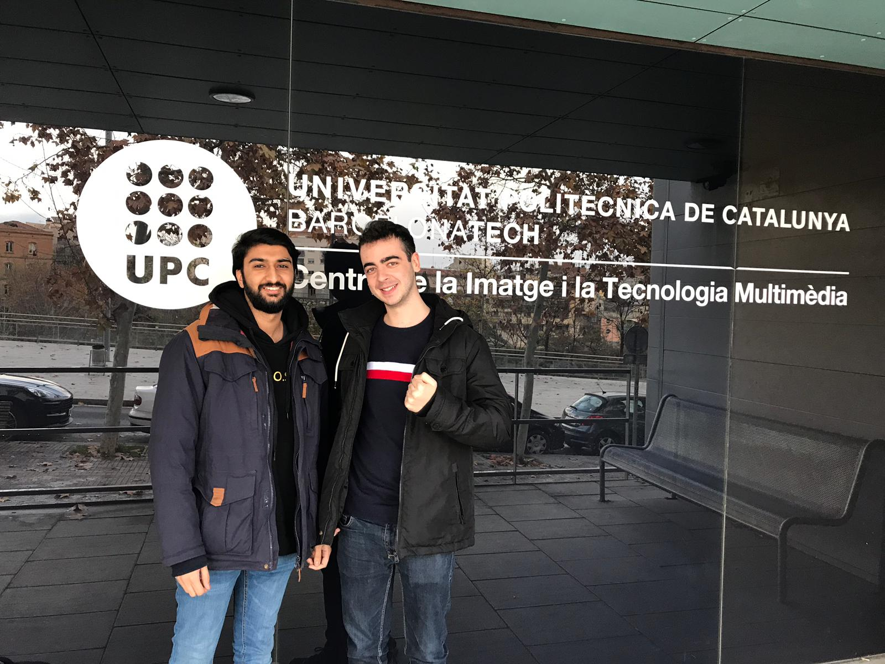

# OwnMarioBros

## Introduction

Own Mario Bros is a 2D platform game based with a nostalgic feature as its graphics are from the orignial Super Mario Bros. Reach to the end without falling down the pits. We are two students of the Univesitat Politècnica de Catalunya, in CITM doing a project for our carreer in Videogame Development and Design.

## Members

* José Rodríguez: 

[Github Link](https://github.com/joserm45)

**Implementation:**

Map draw implementation, parallax implementation, camera movement, changing levels, logic and collider layer implementation, colliders, double jump, save and load, frame rate and dt, entity system implementation, enemy save and load, UI structure, labels, buttons, save and load UI, update in game UI element (lives, score, time, coins).

* Manav Lakhwani: 

[Github Link](https://github.com/manavld)

**Implementation:**

Module player, mario sprites and animations, tiled, audio implementation, player death and respawn, god mode, win, goomba and movement, enemy sprited and animations, brofiler implementation, entity system UML, fade to black, coins, UI atlas and passing from scene to scene control, main menu, setting and credit menu, paused menu, UI UML, website, UI audio, volume adjustment. 

## How To Play

### Instructions

Reach to the end of the map without dying by an enemy or falling through any pit, you only have 3 lives. Collect as many coins as posible and complete the level as fast as you can. Be careful, you can only kill the goomba by falling on top of his head.

### Controls

* D : Move Right
* A : Move Left
* S : Crouch
* SPACE: Jump
* ESC: Pause/Resume game

### Main Menu

* Play: Start new game
* Continue: Load saved game(if it exists)
* Settings: Go to settings menu (volume adjustment)
* Credits: Go to credits menu (license and authors)
* Exit: Close game

### Paused Menu

* Resume / ESC: Unpause and continue game
* Volume: Adjust game volume
* Main Menu: Go back to main menu

### In Game UI

* Score
* Lives
* Coins
* Time

### Debug Keys

* F1 : Load Level 1
* F2 : Load Current Level
* F3 : Load Level 2
* F5 : Save Game
* F6 : Load Game
* F8 : Debug UI
* F9 : Show Colliders/Logic
* F10 : God Mode
* F11: Enable/Disable FPS cap to 30

## Github Project Repository

[Github Project](https://github.com/joserm45/Own-Mario-Bros)

## Release Link

Download the release and execute the .exe, no need of any installation process.

[Release](https://github.com/joserm45/Own-Mario-Bros/releases/tag/1.0V)

## Gameplay Video

<video src="OwnMarioBrosGameplayG.mp4" width="500" height="300" controls preload></video>

## License

We use the MIT License this is a permissive free software license originating at the Massachusetts Institute of Technology.

Permission is hereby granted, free of charge, to any person obtaining a copy of this software and associated documentation files (the “Software”), to deal in the Software without restriction, including without limitation the rights to use, copy, modify, merge, publish, distribute, sublicense, and/or sell copies of the Software, and to permit persons to whom the Software is furnished to do so, subject to the following conditions:

The above copyright notice and this permission notice shall be included in all copies or substantial portions of the Software.

THE SOFTWARE IS PROVIDED “AS IS”, WITHOUT WARRANTY OF ANY KIND, EXPRESS OR IMPLIED, INCLUDING BUT NOT LIMITED TO THE WARRANTIES OF MERCHANTABILITY, FITNESS FOR A PARTICULAR PURPOSE AND NONINFRINGEMENT. IN NO EVENT SHALL THE AUTHORS OR COPYRIGHT HOLDERS BE LIABLE FOR ANY CLAIM, DAMAGES OR OTHER LIABILITY, WHETHER IN AN ACTION OF CONTRACT, TORT OR OTHERWISE, ARISING FROM, OUT OF OR IN CONNECTION WITH THE SOFTWARE OR THE USE OR OTHER DEALINGS IN THE SOFTWARE.

[MIT](https://opensource.org/licenses/MIT)

All art and audio used belongs to Nintendo and their Super Mario Bros game.

